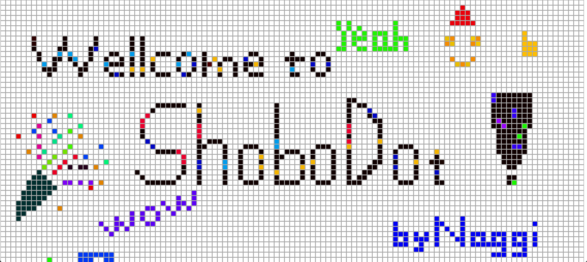
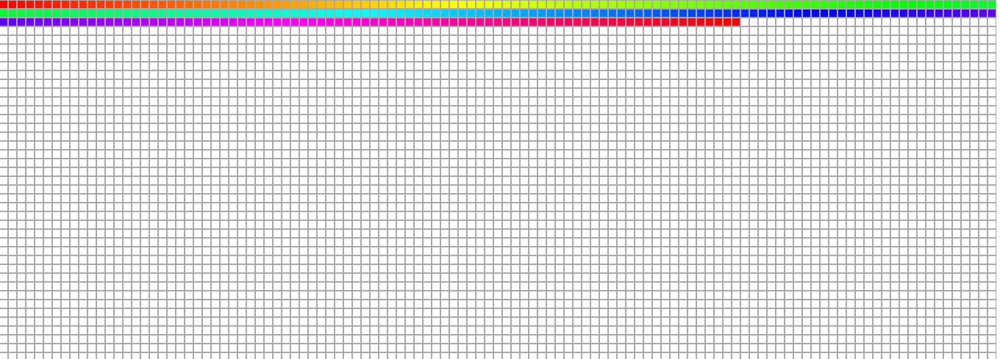

# ShoboDot - A dot canvas written in pure Javascript



**ShoboDot is a easy way to embed the dots canvas into your app**<br>
This is all written in pure Javascript.


# How to use ShoboDot

- change color – click the colorbox whose color is what you want.
- change colorbox’s color – type ‘option’ key on your keyboard.
- delete – click the dot while pushing ‘command’ key down.
- save – you can not save. just screenshot it and share with (me)[https://naggi-goishi.github.io/about/]!

# How to setup

You need only three steps.

First. Include shobodot.min.js in your header of HTML file.
```html
<script src='path/to/shobodot.min.js'></script>
```
Second. Prepare the element, whose class is shobodot and set height and width of it as you like.
```html
<div class='shobodot' style='height:100px; width:100%;'></div>
```
Third. Write one line of Javascript.
```html
<script>
  var shobodot = new ShoboDot();
</script>
```

# Function and Property that you can use.

```javascript
// Paint function takes maximum 3 arguments - dot, color, name. By using this you can paint a dot.
// The first argument, dot, must be DOM which you want to paint dot.
// The second argument (optional), color, must be String which represent a color, ex) 'rgb(255, 0, 0)'. If you don't set it, it will be black by default.
// The third argument (optional), name, must be String. If you want to name your dot, you may give this argument. The name will be appear in the class of the dot.
paint(dot, color, name);

// With deleteDot function you can delete a dot.
// You must give the dot you want to delete as DOM.
deleteDot(dot)

// getPositionId will return you an integer which corresponding to the arguments you give to it.
// (0,0) point is at the upper top of the dots. As it go down, x will incease and as it go left, y will increase.
getPositionId(x, y)


```

## Configuration

You can change two configuration of the dots.

### colorBoxes



If you want to set the colorBoxes above like above, you could give argument like this.
```javascript
var = new ShoboDot({colorBoxes: true});
```

### clickFunction

If you want to click and paint the dot, you can do like this.
```javascript
var = new ShoboDot({clickFunction: true})
```

Of course you can make both of them active, like this.
```javascript
var = new ShoboDot({colorBoxes: true, clickFunction: true});
```
By default, they both are false.

# Contribution

I would welcome any kind of contribution.<br>
However, before making any pull request,
I would be appreciate if you post an issue unless your change is fixing obvious bugs.<br>
Thank you!.
